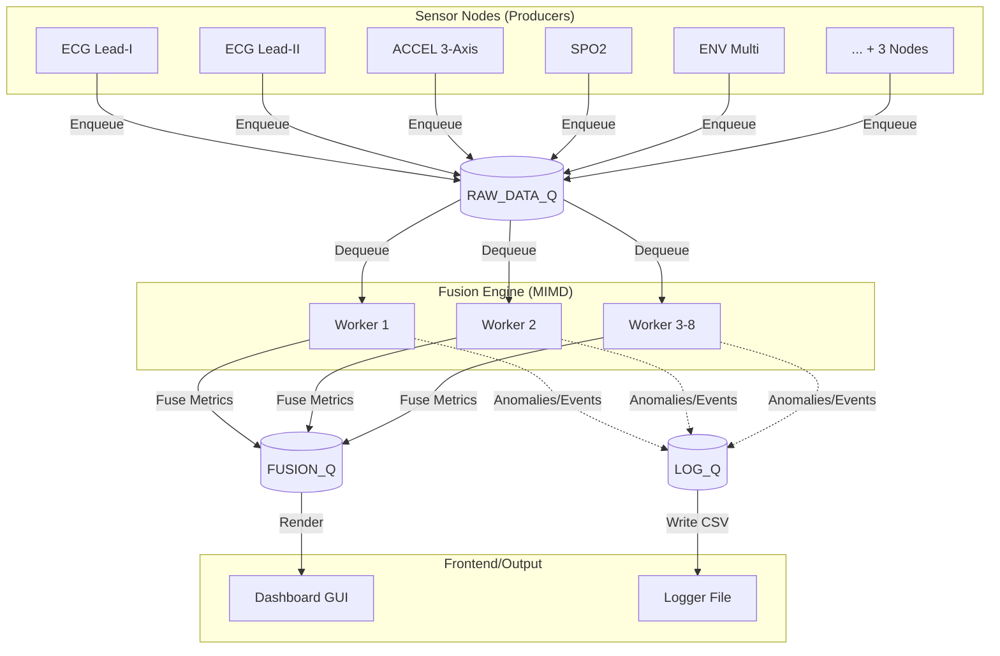

<div align="center">
  
# 💓 PULSE  
**Parallel Unified Live Sensor Engine**

[](https://www.python.org/downloads/)
[](LICENSE)
[]()
[]()

Sistem Pemantauan Atlet Berbasis Wearable *(Software Simulation)*  
Dikembangkan untuk tugas mata kuliah **Parallel Computing & Distributed Systems (IFB-206)**  
Institut Teknologi Nasional (ITENAS) Bandung.

</div>

---

## 📖 Deskripsi

**PULSE** adalah *engine* simulasi berbasis perangkat lunak untuk sistem pemantauan fisiologis atlet secara *real-time*. Proyek ini dirancang sebagai bentuk implementasi langsung dari teori arsitektur *embedded terdistribusi* (seperti pada perangkat biomedis berbasis STM32) yang dipetakan menjadi aplikasi perangkat lunak multi-proses murni.

Menggunakan prinsip komputasi paralel untuk melampaui batasan Global Interpreter Lock (GIL) pada Python, PULSE menyimulasikan aliran data dari 8 sensor fisik berbeda secara asinkron, memproses *feature extraction* paralel penuh, dan menampilkannya pada dashboard SCADA secara sinkron dan interaktif.

## 📋 Daftar Isi

- [Fitur Utama](#-fitur-utama)
- [Konsep Paralel yang Diterapkan](#-konsep-paralel-yang-diterapkan)
- [Arsitektur Sistem](#-arsitektur-sistem)
- [Prasyarat & Instalasi](#-prasyarat--instalasi)
- [Cara Penggunaan](#-cara-penggunaan)
- [Struktur Repositori](#-struktur-repositori)
- [Lisensi](#-lisensi)

---

## ✨ Fitur Utama

- **Simulasi Sinyal Realistis**: Generator sinyal sintetik fisiologis (ECG, Accelerometer, SpO2, Suhu, GSR, Laju Napas) yang berubah sesuai fase lari (Resting, Warmup, Sprint, Cooldown, Recovery).
- **Dashboard SCADA**: Visualisasi *live chart* berkecepatan tinggi menggunakan kolaborasi `Tkinter` dan `Matplotlib`. Memiliki peringatan kondisi *emergency* yang responsif.
- **Deteksi Anomali**: Triase medis secara langsung yang mendeteksi indikasi kondisi bahaya, misal hipoksia (SpO2 rendah), takipnea, atau hipertermia.
- **Benchmarking Terintegrasi**: Mengukur *speedup* pemrosesan sekuensial vs paralel secara transparan untuk memvalidasi performa algoritma.
- **Log Data Persisten**: Hasil pemrosesan direkam pada file `.csv` (*thread-safe* file writing).

---

## 🧠 Konsep Paralel yang Diterapkan

Sistem dibangun dari nol untuk merepresentasikan teori dari komputasi terdistribusi:

1. **MIMD (Multiple Instruction, Multiple Data)**
   Memanfaatkan `multiprocessing.Pool`, di mana setiap unit data dari 8 tipe sensor (*Multiple Data*) diproses secara paralel menggunakan fungsi/jalur logika yang unik sesuai sensor tersebut (*Multiple Instructions*).
2. **Pola Producer-Consumer (Pipeline Processing)**
   Arsitektur aliran data diisolasi ke dalam 4 stage queue (*multiprocessing.Queue*):
   `RAW_DATA_Q` ➔ `PROCESSED_Q` ➔ `FUSION_Q` ➔ `LOG_Q`.
3. **Analisis Hukum Amdahl**
   Menghitung fraksi paralel kode ($P$) dan limitasi teoretis kecepatan performa tak hingga ($N \to \infty$) melalui alat evaluasi internal (`benchmarker.py`).
4. **Fault Tolerance & Penanganan Deadlock**
   PULSE tahan terhadap fluktuasi latensi simulasi dan interupsi transmisi. Menerapkan 3 tingkat ekskalasi pemulihan: *Re-sample*, *Last Known Value fallback*, hingga *Node Exclusion*.

---

## 📊 Arsitektur Sistem

Aliran data (*Data Flow*) didesain dalam bentuk graf tertutup seperti ini:



---

## 🛠️ Prasyarat & Instalasi

Pastikan komputer/server Anda menggunakan **Python 3.10 atau lebih baru**. 

1. **Clone repositori**
   ```bash
   git clone https://github.com/username/PULSE-Engine.git
   cd PULSE-Engine
   ```

2. **Buat Virtual Environment (Direkomendasikan)**
   ```bash
   # Windows
   python -m venv .venv
   .venv\Scripts\activate

   # Linux/macOS
   python3 -m venv .venv
   source .venv/bin/activate
   ```

3. **Install Dependensi**
   ```bash
   pip install -r req.txt
   ```
   *Catatan: Pustaka pihak ketiga yang digunakan hanya `numpy`, `matplotlib`, dan `psutil`.*

---

## 🚀 Cara Penggunaan

Gunakan *entry point* dari `main.py` untuk menjalankan aplikasi:

```bash
python main.py
```

*(Untuk OS Windows Command Prompt / PowerShell, tambahkan flag UTF-8 jika tabel pada console acak-acakan)*:
```bash
python -X utf8 main.py
```

### Operasional Dashboard

1. **Memulai Sesi**: Klik tombol `▶ START` pada menu navigasi bawah untuk memulai pengambilan sampel.
2. **Monitoring Fase**: Lari akan berganti fase secara otomatis (RESTING ➔ WARMUP ➔ SPRINT ➔ COOLDOWN ➔ RECOVERY). 
3. **Benchmarking**: Klik tombol `📊 BENCHMARK`. Sistem akan mensimulasikan tugas pemrosesan *heavy-load* di *background*, dan di akhir akan melaporkan kalkulasi efisiensi dan mencetak grafik `.png` pada direktori `logs/`.
4. **Penyimpanan**: Klik `💾 SAVE LOG` untuk mengekstrak rangkuman sesi pada `logs/summary.csv`.

---

## 📁 Struktur Repositori

```text
PULSE/
├── main.py                # Titik masuk aplikasi, orchestrator startup/shutdown
├── config.py              # Konfigurasi global (Warna UI, Parameter Sistem, Range Medis)
├── dashboard.py           # GUI SCADA Tkinter & Visualisasi Matplotlib
├── benchmarker.py         # Analisis performa sekuensial vs paralel (Amdahl's Law)
├── fusion_engine.py       # Engine perhitungan feature extraction multiprocess (MIMD)
├── queue_manager.py       # Abstraksi multiprocessing.Queue Pipeline
├── session_controller.py  # Sistem state-machine fase sesi & kolektor sampel
├── sensor_nodes.py        # Simulasi/Generator Sinyal Wearable Biomedis
├── logger.py              # Sistem persisten data dan terminal log writer
├── req.txt                # Berkas dependensi pustaka
└── logs/                  # [Dihasilkan] Direktori penyimpanan CSV / Grafik
```

---

## 📄 Lisensi

Didistribusikan di bawah lisensi MIT. Lihat file `LICENSE` untuk informasi lebih lanjut.

<p align="right">(<a href="#readme-top">kembali ke atas</a>)</p>
