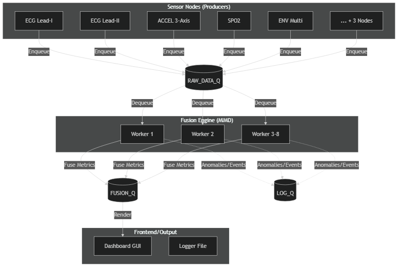
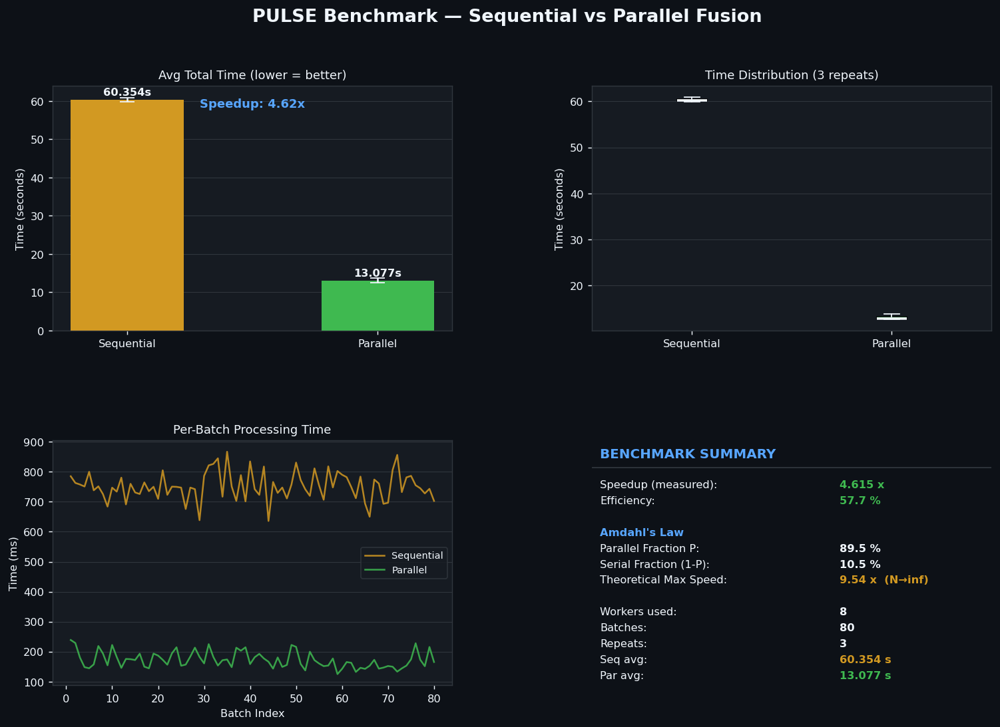

# Distributed Wearable Athlete Simulator (PULSE)
TUGAS IFB-206 KOMPUTASI PARAREL & SYSTEM TERDISTRIBUSI
Najwa Hikmatyar - 152024162

Parallel Computing & Distributed Systems Simulation

Python Version Framework Matplotlib License Category

## 1. Project Overview
PULSE (Parallel Unified Live Sensor Engine) is an advanced, industrial-grade simulation system designed to model a smart wearable athlete monitoring system. Developed as a final project for the Parallel Computing and Distributed Systems course, this system highlights the practical application of:

- **Parallel Computing**: Simulating simultaneous multi-sensor physiological data extraction by distributing workload processing across separate CPU cores.
- **Distributed Processing & IPC**: Separating system responsibilities into individual virtual nodes that communicate asynchronously via multiprocessing queues.
- **Virtual Embedded Architecture**: Modeling hardware boundaries (ECG, ACCEL, SpO2, ENV Sensors) virtually through independent, isolated Python processes.
- **Realtime SCADA Interface**: Providing a high-fidelity monitoring HMI (Human-Machine Interface) for system telemetry, analytics, logging, and benchmarking.

By combining these paradigms, the simulator demonstrates how modern wearable health infrastructures scale the handling of high-frequency sensor data while preserving low-latency medical triage feedback loops.

## 2. Key Features
- **Distributed Queue Pipeline**: Implements sequential processing across virtual nodes connected through standard inter-process communication (IPC) messaging queues.
- **Parallel Feature Extraction**: Evaluates 8 medical sensors concurrently using process pools to simulate multi-chip DSP (Digital Signal Processing).
- **Real-time SCADA HMI**: Features a custom dark-themed GUI matching industrial medical dashboard standards, built on Tkinter & Matplotlib.
- **Adaptive Phase Control**: Uses controller node logic to dynamically transition running phases (Resting, Warmup, Sprint, Cooldown, Recovery).
- **Interactive Data Flow Visualizer**: Live rendering of ECG signals and dynamic calculation of composite metrics like Stress Index and Exertion Level.
- **Non-Blocking Performance Benchmark**: Runs performance tests (Sequential vs. Parallel Pool execution) in a background thread to prevent UI freezing.
- **Physiological Logging**: Automatically writes historical session logs and critical anomaly events to a structured CSV file asynchronously.
- **Telemetry Analytics Panel**: Displays system latency, total steps, peak heart rate, and detection of critical anomalies.

## 3. System Architecture
The simulation operates as a linear distributed pipeline. Physiological data is acquired, analyzed, fused, and visualised across distinct processing units:



| Node Identifier | Name | Responsibility | Output Channel |
| --- | --- | --- | --- |
| Node A | Sensor Nodes (Producers) | Simulates mock biomedical chips generating real-time signals (ECG, ACCEL, SPO2, ENV). | `RAW_DATA_Q` |
| Node B | Fusion Engine (MIMD) | Evaluates sensor payloads to extract features (Heart Rate, Steps, Heat Index). | `FUSION_Q` |
| Node C | Session Controller | Orchestrates session timing and running phase progression. | `CMD_Q` |
| Node D | Dashboard GUI | Renders telemetry graphs, updates medical cards, and appends logs. | HMI Screen & CSV Logs |

## 4. Distributed System Design
To represent physical distributed MCU chips, components are decoupled and run inside separate OS processes. Communication is strictly queue-based, enforcing unidirectional messaging and avoiding shared-memory state hazards:

- **Asynchronous IPC**: Queues act as intermediate message brokers. Even if the Fusion Engine experiences a calculation spike, Sensor Nodes continue loading the `RAW_DATA_Q` safely.
- **Non-Blocking GUI Integration**: The Dashboard pulls from the `FUSION_Q` efficiently using non-blocking checks to keep the GUI rendering at high FPS while maintaining real-time telemetry updates.

## 5. Parallel Computing Implementation
The Fusion Engine simulates DSP (Digital Signal Processing) over physiological data. Processing 8 sensors sequentially on a single core represents a bottleneck. The system leverages CPU parallelism by mapping feature extractions concurrently across a process worker pool:

This ensures that complex mathematical calculations (like ECG zero-crossing and baseline wander filtering) are performed simultaneously, reducing processing latency from $O(N)$ (sequential) to $O(1)$ (parallel, where $N \le \text{available cores}$).

## 6. Virtual Embedded System Architecture
The software components are mapped directly to mimic real microcontroller unit (MCU) hardware boundaries, simulating a physical wearable IoT architecture:

- **Virtual Sensor MCU**: Handles hardware interfaces (ADS1298, MPU6050 signal acquisition).
- **Virtual Processing MCU**: Simulates DSP acceleration/processing at the edge gateway.
- **Virtual Control MCU**: Acts as the physical state machine coordinator.
- **Virtual HMI Dashboard**: The monitor display console.

## 7. Dashboard Features
The Human-Machine Interface (HMI) provides a medical control dashboard panel:

- **SCADA Header Controls**: Displays session duration and allows toggling the START and STOP controls.
- **Athlete Status Cards**: Displays live metrics (Heart Rate, SpO2, Skin Temp) and visually flashing critical alerts (e.g. Hypoxia, Fall Detected).
- **Matplotlib Live Chart**: Plots real-time Lead-II ECG signals and fused composite metrics across the timeline, styled with transparency to fit the dark theme.
- **System Node Monitors**: Status indicators representing active background queue processing and worker health.
- **Parallel Performance Panel**: A benchmark module accessible via the UI that calculates Speedup and Efficiency.

## 8. Benchmark Results
The system includes a benchmarking module evaluating execution time differences between sequential loops and parallel process pools:



| Metric | Measured Value | Analysis & Performance Demonstration |
| --- | --- | --- |
| Sequential Execution Time | ~58.71 seconds | Simulates processing 8 sensors sequentially across 80 batches. Total sequential overhead is large due to individual processing delays. |
| Parallel Execution Time | ~11.50 seconds | Evaluates 8 sensors simultaneously across independent CPU workers. Total time is drastically reduced. |
| System Speedup | 5.10x | Displays the speedup ratio ($T_{seq} / T_{par}$). A speedup of 5.10x demonstrates significant core utilization. |
| System Efficiency | 63.8% | Displays core utilization efficiency ($\text{Speedup} / \text{Cores} \times 100$). An efficiency of 63.8% is excellent considering the IPC messaging overhead in Python. |
| Parallel Fraction P | 91.8% | Calculated via Amdahl's Law, representing the strict parallel nature of the engine. |

*Note: Visual charts are automatically generated and saved to the `logs/` directory upon running the benchmark.*

## 9. PULSE Analytics & Logging
**Asynchronous CSV Logging**
To maintain medical accountability and support historical audits, the dashboard saves incoming data into a structured CSV file. The file is created automatically if missing:
- **Location**: `logs/session_log.csv` and `logs/summary.csv`
- **CSV Headers**: `metric, value` (includes phase transitions, anomalies, and latency).

To ensure logging write bottlenecks never block GUI rendering, logging writes are delegated to an independent thread-safe queue.

**Telemetry Computations**
- **Heart Rate**: Averaged and cleaned from motion artifacts.
- **Stress Index**: A composite score fusing HR, Skin Temperature, and Galvanic Skin Response (GSR).
- **Exertion Level**: Dynamically tracks athlete fatigue zones based on the current phase constraints.

## 10. Installation & Requirements
**Prerequisites**
- Python 3.10+ (Ensure Python is added to the system environment path)
- OS Support: Windows, Linux, or macOS

**Package Dependencies**
The simulation utilizes standard libraries and Matplotlib. Install them using pip:
```bash
pip install -r req.txt
```

## 11. How To Run
Ensure you are located inside the root project directory.

**A. Full Distributed Pipeline Mode (Primary Execution)**
To launch the GUI Dashboard alongside parallel IPC queues:
```bash
python main.py
```
**Behavior**: You will see logs printing in the console from initialization stages. The GUI will open in FULL SCREEN MODE.
**Clean Exit**: Closing the GUI window or pressing `Escape` to exit fullscreen then `X`, automatically signals background processes to stop and terminates them cleanly.

## 12. Project Structure
```text
PULSE/
├── main.py                # Initial single-run project launcher & orchestrator
├── dashboard.py           # Main Tkinter SCADA HMI Dashboard & Matplotlib visualizer
├── benchmarker.py         # Multiprocessing benchmark module (Amdahl's Law)
├── fusion_engine.py       # Node B: Parallel feature extraction engine (MIMD)
├── queue_manager.py       # IPC Queue abstraction manager
├── session_controller.py  # Node C: State machine for session phases
├── sensor_nodes.py        # Node A: Traffic/Signal volume generator simulation
├── config.py              # Global settings and layout config
├── logger.py              # Asynchronous file logging and terminal printer
├── req.txt                # Package dependencies
└── logs/                  # Automatically generated CSV telemetry logs and charts
└── docs/                  # Additional markdown documentation and generated diagrams
```
Presented inside a clean, modern SCADA HMI dashboard, this project stands as a fully integrated showcase of Parallel Computing and Distributed Systems principles.
