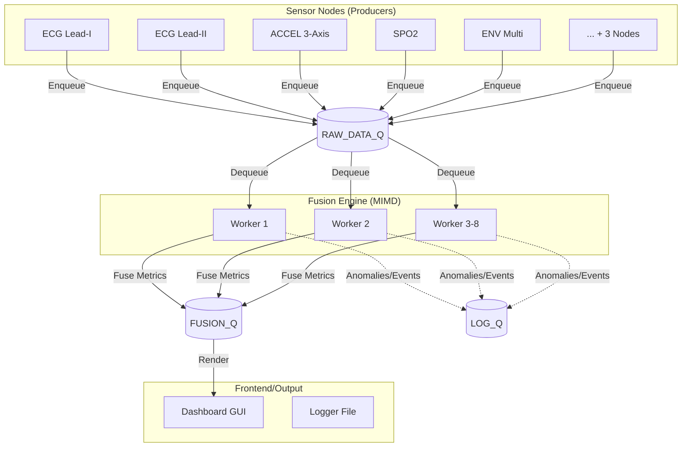

# Arsitektur dan Desain Sistem PULSE

PULSE (Parallel Unified Live Sensor Engine) adalah simulator pemantauan atlet berbasis *wearable* (seperti *smartwatch* atau *chest strap*) yang memproses data fisiologis secara *real-time*.

## Diagram Aliran Data (Data Flow)

Sistem menggunakan arsitektur *Producer-Consumer* yang dihubungkan dengan *Multiprocessing Queues* untuk menjamin eksekusi paralel yang sesungguhnya (melewati GIL Python).

## Komponen Utama
1. **Sensor Nodes (`sensor_nodes.py`)**: 8 modul penghasil data sintetis (ECG, ACCEL, SPO2, ENV) yang meniru *chip* perangkat keras nyata (misalnya ADS1298, MPU6050).
2. **Queue Manager (`queue_manager.py`)**: Bertanggung jawab atas pendistribusian antrean antar-proses (`RAW_DATA_Q`, `FUSION_Q`, `LOG_Q`, `CMD_Q`).
3. **Fusion Engine (`fusion_engine.py`)**: Jantung pemrosesan. Terdiri dari *Worker Pool* yang mengekstraksi fitur (seperti penghitungan detak jantung dari ECG, atau *zero-crossing* untuk menghitung langkah kaki) dan menggabungkan hasilnya menjadi satu wawasan utuh (misal: *Stress Index*).
4. **Session Controller (`session_controller.py`)**: *State machine* yang mengatur fase lari atlet (`RESTING`, `WARMUP`, `SPRINT`, `COOLDOWN`, `RECOVERY`).
5. **Dashboard (`dashboard.py`)**: Antarmuka SCADA-style berbasis Tkinter & Matplotlib.
